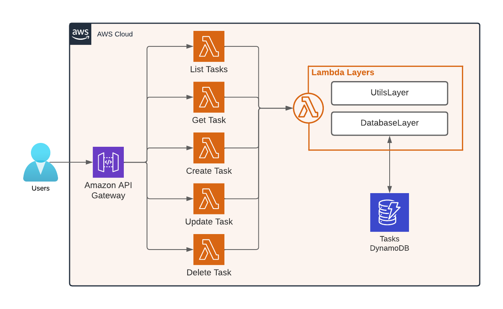

# AWS ToDo List

## Overview



## Prerequisites

- [npm](https://nodejs.org/en/download/) (normally comes with Node.js)
- [AWS CLI](https://docs.aws.amazon.com/cli/latest/userguide/getting-started-install.html)

## To Use

### API Endpoints
  
- [Postman Collection](postman_collection.json)

### Deploy

```bash
npm run build
npm run deploy:dev
```

```powershell
npm install
cd layers/database/nodejs; npm install; Copy-item -Path ./*.js -Destination ./node_modules
cd ../../..
cd layers/utils/nodejs; npm install; Copy-item -Path ./*.js -Destination ./node_modules
cd ../../..
```

## Clean Up

```bash
npm run destroy:dev
```
